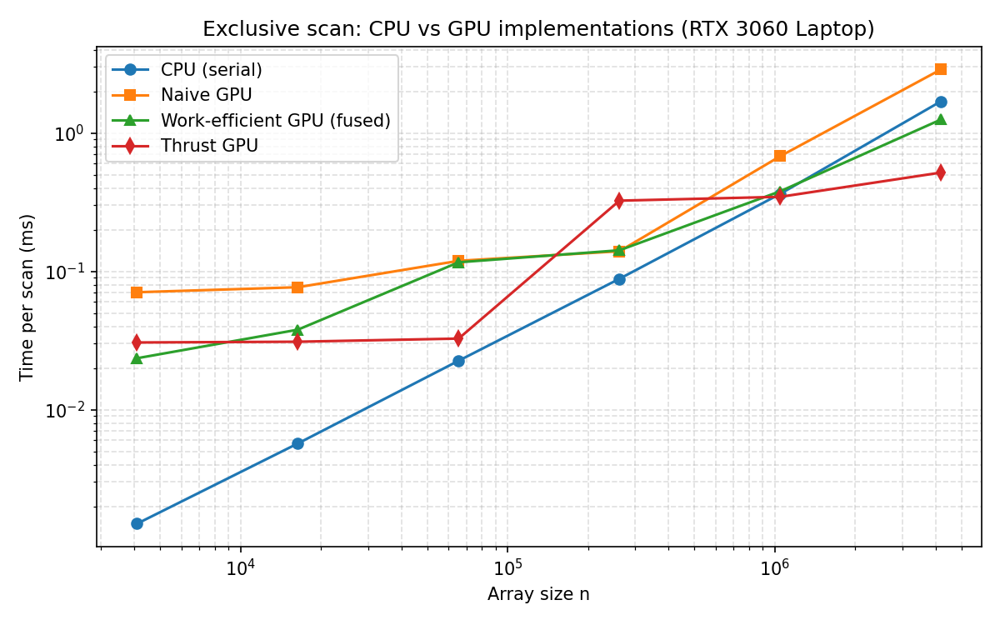
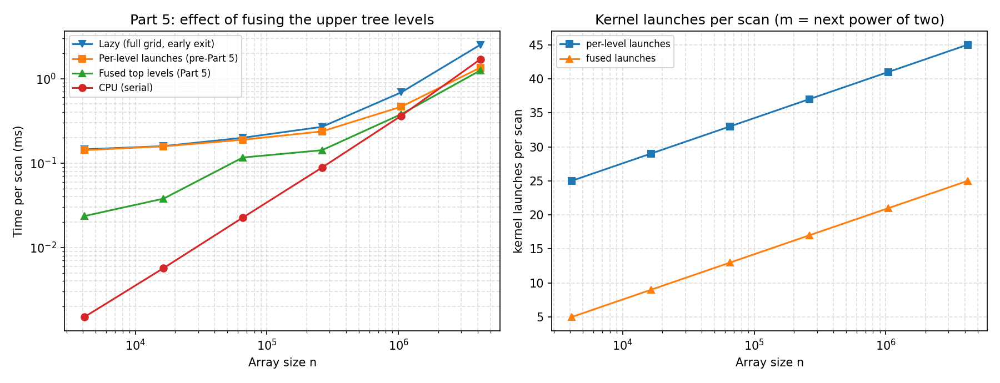

# CUDA Stream Compaction

**University of Pennsylvania, CIS 5650: GPU Programming and Architecture,
Project 2 - Stream Compaction**

* **Jing Huang**
  * [GitHub](https://github.com/Stabil1ze)
* Tested on: Windows 11, Intel i7-12700H @ 2.30GHz 23GB,
  NVIDIA GeForce RTX 3060 Laptop GPU 6GB (Personal computer)

## Overview

This project implements several versions of the **scan** (exclusive prefix sum)
algorithm together with **stream compaction** that removes all `0`s from an
array of `int`s. The same building blocks (scan + scatter) will later be used
in the path tracer to compact away terminated rays.

Implemented features:

1. **CPU scan & compaction** (`cpu.cu`)
   - Serial exclusive scan (reference implementation for every GPU test).
   - `compactWithoutScan`: one pass with a running output pointer.
   - `compactWithScan`: CPU version of map -> scan -> scatter.
2. **Naive GPU scan** (`naive.cu`)
   - GPU Gems 3, 39.2.1 style scan using two global-memory buffers that are
     swapped for each doubling offset (`ilog2ceil(n)` kernel invocations).
   - One block size for the whole grid (512, see below).
3. **Work-efficient GPU scan & compaction** (`efficient.cu`, `common.cu`)
   - Blelloch up-sweep / down-sweep that launches only the active tree nodes
     (the node index comes from the level's active merge count, so no thread
     touches a node that does not exist).
   - **Part 5**: the upper levels are fused into one 1024-thread block that walks
     them with `__syncthreads()` in between, cutting the launches per scan from
     `2*log2(m)+1` to `2*log2(m/2048)+3` (45 -> 25 at `n = 2^22`, 25 -> 5 at
     `n = 2^12`). See
     [Part 5](#part-5-extra-credit-5-why-is-my-work-efficient-gpu-scan-slower-than-the-cpu).
   - `Common::kernMapToBoolean` and `Common::kernScatter` add stream compaction
     on top of the scan.
4. **Thrust scan** (`thrust.cu`)
   - Thin wrapper around `thrust::exclusive_scan`; device-vector setup and the
     final copy are excluded from the measured region.
5. **CUDA error checking** (`naive.cu`, `efficient.cu`, `thrust.cu`)
   - Every `cudaMalloc`, `cudaMemcpy` and kernel launch is followed by
     `checkCUDAError(...)` (11 call sites), always placed *outside* the timed
     regions so the measured times stay comparable with the reference harness.
6. **Radix sort on top of the scan** (extra credit 1, `radix_sort.{h,cu}`)
   - Stable 8-bit LSD radix sort: per-block histograms, the work-efficient scan
     for the global bucket offsets, then a warp-ranked stable scatter. Four
     passes sort a whole 32-bit `int`, negative values included. See
     [Extra Credit 1](#extra-credit-1-radix-sort-10).

All GPU scans support **non-power-of-two** inputs: work-efficient kernels pad
the logical array to the next power of two and only report the first `n`
results.

## Performance Analysis

All numbers below come from `src/bench.cu` (see
[CMakeLists.txt changes](#cmakeliststxt-changes)). It drives the implementations
through the project's own `PerformanceTimer`, so the timed region matches the
supplied test program: kernel work only, with `cudaMalloc`/`cudaMemcpy`
excluded. Each cell is the median of three processes, each of which takes 150
samples (50 scans x 3 repetitions) of random values in `[0, 100)`. The harness
also checks every variant against the CPU reference and exits non-zero on a
mismatch.

Release build (CMake + Ninja, CUDA 13.3), RTX 3060 Laptop GPU.

| n        | CPU scan (ms) | Naive scan (ms) | Work-efficient (ms) | Thrust (ms) |
|----------|--------------:|----------------:|--------------------:|------------:|
| 4,096    | 0.0015        | 0.0707          | 0.0236              | 0.0306      |
| 16,384   | 0.0057        | 0.0768          | 0.0379              | 0.0310      |
| 65,536   | 0.0226        | 0.1192          | 0.1163              | 0.0327      |
| 262,144  | 0.0884        | 0.1398          | 0.1420              | 0.3245      |
| 1,048,576| 0.3634        | 0.6803          | 0.3793              | 0.3459      |
| 4,194,304| 1.6967        | 2.8851          | 1.2528              | 0.5180      |



### Block-size selection

Swept at `n = 2^22` (median of many runs):

| Implementation | Sizes tried | Best | Notes |
|---|---|---|---|
| Naive scan | 128, 256, 512, 1024 | 512 | Memory-bound full-grid kernels; 512 balances blocks/SM with coalesced global access |
| Work-efficient, per-level kernels | 64, 128, 256 | 64 | Deep tree levels launch very few threads; small blocks reduce launch idle work without hurting occupancy |
| Work-efficient, Part 5 fused block | 256, 512, 1024 | 1024 | The fused block should cover as many levels as possible, so the largest legal block wins |

Only the fused block changes the *number of kernel launches*, and that is what
dominates at small `n`:

| `FUSED_BLOCK_SIZE` | launches @ `2^12` | time @ `2^12` (ms) | launches @ `2^22` | time @ `2^22` (ms) |
|---|---|---|---|---|
| 256 | 9 | 0.0508 | 29 | 1.341 |
| 512 | 7 | 0.0328 | 27 | 1.306 |
| 1024 | 5 | 0.0272 | 25 | 1.329 |

(`50 x 3` medians; 512 was measured once, the others twice. At `2^22` all three
agree within run-to-run noise; at `2^12` every extra launch costs ~5 us, which
is exactly the ~0.02 ms gap between the 5-launch and 9-launch configurations.)

### Observations

* **The serial CPU scan wins up to about `n = 2^20`.** At `2^12` it needs
  0.0015 ms against 0.0236 ms for the fastest GPU scan; the crossover is at
  `2^20` (0.3634 vs 0.3793 ms, a tie), and at `2^22` the work-efficient scan is
  1.35x and Thrust 3.3x faster. The CPU loop is one linear pass over
  cache-friendly memory with zero setup cost, while a GPU scan pays tens of
  microseconds of launch and issue overhead before touching a byte.
* **The naive scan scales worst.** It is O(n log n): each of its 22 doubling
  kernels at `2^22` sweeps the whole array (about 34 MB per kernel, ~740 MB in
  total). It is memory-bound and the slowest implementation at 4M (2.8851 ms).
* **The work-efficient scan moves far less data** (only the active tree nodes,
  roughly 100 MB at `2^22`) but pays one launch per level. Part 5 removes most of
  that overhead, so it is now the fastest hand-written scan at 4M (1.2528 ms).
* **Thrust wins for `n >= 2^18`.** CUB scans device-wide in one kernel with a
  decoupled look-back design (0.5180 ms at 4M, 2.4x faster than my best tree
  scan). Below ~64K its own dispatch cost dominates (~0.03 ms regardless of
  size), and it gets *slower* again at `2^18`-`2^20` (0.32-0.35 ms), where
  temporary-buffer management and a multi-pass path show up.
* **Block size is a second-order effect** (10-30%) for the naive and per-level
  scans: they are limited by launch latency at small `n` and by memory traffic
  at large `n`, not by per-thread work.

## Part 5 (extra credit, +5): why is my work-efficient GPU scan slower than the CPU?

### The symptom

Before Part 5 the work-efficient scan needed **0.1423 ms at `n = 2^12`** while
the serial CPU scan needed **0.0015 ms** - about 95x slower - and it stayed
behind the CPU until roughly `2^21` elements.

### Where the time goes

The harness separates the two candidate costs: `Lazy` launches the full
`m/2`-thread grid at every level and lets the guard drop the idle threads,
`PerLevel` launches only `ceil(active/64)` blocks per level, and `Efficient` is
this project's fused version.

| n | Lazy (ms) | Per-level (ms) | Fused (ms) |
|---|---|---|---|
| 4,096 | 0.1454 | 0.1423 | 0.0236 |
| 16,384 | 0.1587 | 0.1577 | 0.0379 |
| 65,536 | 0.1994 | 0.1889 | 0.1163 |
| 262,144 | 0.2686 | 0.2372 | 0.1420 |
| 1,048,576 | 0.6877 | 0.4651 | 0.3793 |
| 4,194,304 | 2.5238 | 1.3532 | 1.2528 |

1. **The number of kernel launches dominates at small `n`.** A level-by-level
   Blelloch scan issues `2*log2(m)+1` kernels (up-sweep, one kernel that zeroes
   the last element, down-sweep): 25 at `2^12`, 45 at `2^22`. A back-to-back
   empty kernel launch costs **6.9 us** here (5.4 - 8.9 us across processes), so
   25 launches at ~6 us account for essentially all of the 0.1423 ms measured at
   `2^12`; the tree work itself is a few microseconds.
2. **Compacting the threads alone buys nothing.** `Lazy` and `PerLevel` differ by
   2% at `2^12` (0.1454 vs 0.1423 ms), because launching one block costs the
   same as launching 32,768 blocks. It only matters once the launch count is
   under control: at `2^22` the lazy grid has to *dispatch* 32,768 idle blocks
   per level and is 1.9x slower (2.5238 vs 1.3532 ms).

To check the launch-overhead explanation quantitatively, compare the fused
version with the per-level version launch by launch:

| n | launches before | launches after | removed | time before (ms) | time after (ms) | speedup | implied cost per removed launch |
|---|---|---|---|---|---|---|---|
| 4,096 | 25 | 5 | 20 | 0.1423 | 0.0236 | **6.0x** | 5.9 us |
| 16,384 | 29 | 9 | 20 | 0.1577 | 0.0379 | **4.2x** | 6.0 us |
| 65,536 | 33 | 13 | 20 | 0.1889 | 0.1163 | 1.6x | 3.6 us |
| 262,144 | 37 | 17 | 20 | 0.2372 | 0.1420 | 1.7x | 4.8 us |
| 1,048,576 | 41 | 21 | 20 | 0.4651 | 0.3793 | 1.2x | 4.3 us |
| 4,194,304 | 45 | 25 | 20 | 1.3532 | 1.2528 | 1.08x | 5.0 us |

The last column is `(time before - time after) / 20`, and it lands near the
measured 6.9 us at every size: the gain is exactly *removed launches x launch
latency*, which is what you would expect if the bottleneck is kernel issue
rather than arithmetic.

### The optimization: fuse the upper tree levels into one block

Once a level has at most one block of active merges it no longer needs its own
launch - the same block loops over the remaining levels, with `__syncthreads()`
between them to respect the tree's read-after-write dependencies.

```cpp
const int FUSED_BLOCK_SIZE = 1024;

// Up-sweep of every level whose merge count is <= FUSED_BLOCK_SIZE.
// The old offsets 1, 2, 4, ... are walked inside a single block.
__global__ void kernEfficientUpSweepFused(int m, int firstOffset, int *data) {
    for (int offset = firstOffset; offset < m; offset <<= 1) {
        int active = m / (2 * offset);
        if (threadIdx.x < active) {
            int idx = (threadIdx.x + 1) * (2 * offset) - 1;
            data[idx] += data[idx - offset];
        }
        __syncthreads();
    }
}

// Down-sweep of the levels above `lastOffset`, in the same style.
__global__ void kernEfficientDownSweepFused(int m, int lastOffset, int *data) {
    for (int offset = m / 2; offset >= lastOffset; offset >>= 1) {
        int active = m / (2 * offset);
        if (threadIdx.x < active) {
            int node0 = (2 * threadIdx.x + 1) * offset - 1;
            int node1 = node0 + offset;
            data[node1] += data[node0];
            data[node0] = data[node1] - data[node0];
        }
        __syncthreads();
    }
}
```

`scanDevice` splits the tree at `fusedFirst = m / (2 * FUSED_BLOCK_SIZE)` (or
`1` if that would be zero): levels below it stay per-level launches with the
tuned block size, and the levels above - which used to run with 1 to 1024 active
threads - run in one block (two guards, `fusedFirst < m` and
`fusedFirst <= m / 2`, keep the `m = 1` and `m = 2` cases correct). For
`m <= 2048` a whole scan is three launches (up-sweep, zero the last element,
down-sweep); for `m = 2^22` the 25 launches are 11 bulk up-sweep levels, 1 fused
up-sweep, the zeroing, 1 fused down-sweep and 11 bulk down-sweep levels.



### Why the win shrinks with n

The launches that disappear are the *cheap* ones: the bulk levels keep thousands
of blocks of real work, and not a byte of memory traffic is removed. At `2^22`
that overhead is ~5 us against a ~1.25 ms total, so 1.08x is all this structure
allows; at large `n` the GPU also stays busy during the bulk phase, so
neighbouring launches partly hide behind previous kernels. Going further means
removing launches instead of merging them - a shared-memory tile scan with an
offset pass (extra credit 2, below) or CUB's single-pass decoupled look-back
(0.5180 ms at `2^22`).

### Correctness

* `src/bench.cu` verifies Naive, Efficient, Thrust, Lazy and PerLevel against the
  CPU reference at every benchmarked size; the supplied scan/compaction tests
  pass 12/12 with `SIZE = 256` and with `SIZE = 1 << 20`; compute-sanitizer
  (memcheck) reports 0 errors over the fused *and* the pre-fusion/lazy variants.
* Integer overflow is a real trap at the top level: `(index + 1) * (2 * offset)`
  reaches `2^31` for threads that no longer own a node, and guarding only the
  store was not enough in the full-grid variant - compute-sanitizer still
  reported invalid reads because the address computation had been predicated
  instead of branched away. Every kernel here derives
  `active = m / (2 * offset)` first and only computes the index inside the guard.
* With the new `checkCUDAError` calls, a forced failure
  (`CUDA_VISIBLE_DEVICES=999`) prints
  `CUDA error (naive.cu:49): Naive::scan: cudaMalloc / cudaMemcpy(H2D) failed: no CUDA-capable device is detected`
  and exits with status 1 instead of silently returning garbage.

## Extra Credit 1: Radix Sort (+10)

`stream_compaction/radix_sort.{h,cu}` implements a **stable 8-bit LSD radix
sort** on top of the work-efficient scan, so four counting passes sort a whole
32-bit `int`:

```cpp
#include <stream_compaction/radix_sort.h>

int input[8]  = { 5, -3, 0, 128, 5, 7, -1000, 2 };
int output[8];
StreamCompaction::RadixSort::sort(8, output, input);
// input  [   5  -3   0 128   5   7 -1000   2 ]
// output [ -1000  -3   0   2   5   5   7 128 ]
```

### How it works

One pass per digit, least significant byte first:

1. `kernRadixHistogram` - every block builds a 256-bin histogram of its 4096
   elements in shared memory (one warp per contiguous 512-element chunk) and
   writes the block totals to global memory in **bin-major** layout,
   `hist[digit * numBlocks + block]`.
2. `Efficient::scanDevice(histPadded, devHist)` - the exclusive scan of that
   array *is* the start offset of every (digit, block) pair: in bin-major layout
   the prefix at `(digit, block)` counts all elements with a smaller digit plus
   the elements of the same digit in the preceding blocks.
3. `kernRadixScatter` - every element computes its stable rank inside its warp
   with a warp-level shuffle ranking, adds the per-warp offset and the scanned
   block offset, and writes itself to that position.

Blocks, warps and lanes are all processed in input order, so every pass is
stable and the four passes yield a fully sorted array. Negative values are
handled by flipping the sign bit before the digits are extracted.
`Efficient::scanDevice` was exposed for this so that the per-pass histogram
scans stay in device memory; the histogram is padded to the next power of two
(the padding is never written by the histogram kernel and never read by the
scatter).

### Performance

Mixed-sign random input (every third element negated). The GPU time covers the
four passes only; `std::sort` is sampled 5 times and the GPU sorts 20 times per
size (median), because one `std::sort` of 4M ints already takes ~0.1 s.

| n | std::sort (ms) | RadixSort (ms) | thrust::sort (ms) | speedup vs std::sort |
|---|---|---|---|---|
| 4,096 | 0.1129 | 0.1772 | 0.0594 | 0.64x |
| 16,384 | 0.4604 | 0.2222 | 0.1640 | 2.1x |
| 65,536 | 1.6824 | 0.3132 | 0.1208 | 5.4x |
| 262,144 | 6.8671 | 0.4188 | 0.4864 | 16.4x |
| 1,048,576 | 28.0361 | 0.9173 | 0.7680 | 30.6x |
| 4,194,304 | 113.5395 | 2.3994 | 1.8555 | 47.3x |

(Each cell is a single-process median; repeated runs spread by about 10-30% at
the GPU sizes below 262K elements, so the small-`n` columns are representative
rather than exact. The radix kernels use 8 KB of shared memory and 26/40
registers with no spills, which allows 6 blocks / 1536 threads per SM.)

The small-`n` behaviour is the Part 5 story again: at `2^12` the sort issues 20
kernel launches (4 passes x [histogram, the 3-launch scan of a 256-entry
histogram, scatter]), about 0.12 ms of the 0.177 ms measured. From ~16K elements
up the O(n) counting passes win, reaching 47x over `std::sort` at 4M.
`thrust::sort` (CUB's single-pass segmented radix sort) stays 1.3x ahead because
it needs one kernel per pass instead of a histogram / scan / scatter pipeline
with a global round trip for the offsets. Reproduce with
`stream_compaction_bench.exe --sort`.

### Correctness tests

`src/main.cpp` runs **13 cases**, each compared element by element against
`std::sort` (the sorted sequence of an `int` array is unique, so duplicates are
covered too): the 8-element example above; 256 values in `[0, 100)` and the same
data truncated to 253; 1024 signed values; all-equal, already-sorted and
reverse-sorted input; `INT_MIN` / `INT_MAX` / `0` / `-1` extremes; a single
element; 20000 equal elements and 20000 values with 3 distinct keys (5 blocks,
so the cross-block offsets must line up); 12345 signed values (multi-block *and*
non-power-of-two, which exercises the histogram padding); and `2^20` values
covering the whole 32-bit range.

All 13 pass, compute-sanitizer reports 0 errors, and an additional temporary
out-of-tree fuzz harness matched `std::sort` on 335/335 cases: 300 random sizes
in `[1, 60000]` over six key distributions plus 35 cases at
`n = 4095 ... 2097153`.

## Extra Credit 2: Shared-Memory Scan (+10)

`stream_compaction/shared_scan.{h,cu}` implements both block scans of GPU Gems
chapter 39 in **dynamic shared memory**, plus the hierarchical extension for
arrays larger than one tile. The block size is the last argument (a power of two,
default 256):

```cpp
#include <stream_compaction/shared_scan.h>

int input[N], output[N];
StreamCompaction::SharedScan::scanNaive(n, output, input);            // Example 39-1
StreamCompaction::SharedScan::scanEfficient(n, output, input);        // Example 39-2
StreamCompaction::SharedScan::scanEfficientPadded(n, output, input);  // 39-2, padded
StreamCompaction::SharedScan::scanNaive(n, output, input, 128);       // block size 128
```

Every scan is three steps:

1. `kernTileScanNaive` (39-1) or `kernTileScanTree<PADDED>` (39-2): one block per
   tile of `blockThreads` elements loads its tile into *dynamic* shared memory,
   scans it (Hillis-Steele with register ping-pong for 39-1, Blelloch up-sweep /
   down-sweep for 39-2), writes the exclusive result back, and records the tile
   total in `tileSums[block]`.
2. `Efficient::scanDevice` scans the tile totals - the chapter's "scan the sums"
   step, which reuses the Part 5 scan.
3. `kernAddTileOffsets` adds its tile offset to every element.

For `n = 2^22` with a block of 256 that is 11 kernel launches (tile scan, 9 for
the tile sums, add offsets) instead of the 25 of the level-by-level tree scan.

### Performance

Medians of 20 x 3 samples, release build, same random input as the table above:

| n | CPU | Efficient (fused, Part 5) | 39-1 shared | 39-2 shared | 39-2 padded | Thrust |
|---|---|---|---|---|---|---|
| 4,096 | 0.0021 | 0.0307 | **0.0205** | 0.0236 | 0.0236 | 0.0368 |
| 16,384 | 0.0057 | 0.0492 | **0.0236** | 0.0266 | 0.0266 | 0.0350 |
| 65,536 | 0.0222 | 0.1341 | **0.0571** | 0.0669 | 0.0654 | 0.0369 |
| 262,144 | 0.0906 | 0.1811 | **0.0727** | 0.1006 | 0.0973 | 0.3686 |
| 1,048,576 | 0.3797 | 0.4096 | **0.1341** | 0.2201 | 0.1980 | 0.3768 |
| 4,194,304 | 1.8405 | 1.3641 | **0.4124** | 0.7200 | 0.7011 | 0.5270 |

* The shared-memory scan beats the level-by-level tree scan by 3.3x at 4M and
  also wins at the small end (0.0205 vs 0.0307 ms at `2^12`), because a tile scan
  reaches a whole tile in one kernel instead of one kernel per tree level.
* At 4M it is also 1.28x faster than Thrust (0.4124 vs 0.5270 ms) and 4.5x faster
  than the serial CPU scan; the CPU still wins below ~100K elements.
* **Hillis-Steele (39-1) beats the tree (39-2) at every size** by 1.2-1.8x. All
  of its shared accesses are stride 1 and every thread is active at every level;
  the tree idles half its threads per level (`active = b / (2 * offset)`) and its
  strided node accesses cost more shared-memory transactions.

### Bank conflicts, padding and occupancy

The chapter's tree walk visits nodes at stride `2 * offset`, so at `offset = 1`
two threads hit the same bank (a 2-way conflict). The padded variant stores
element `i` at `i + i / 32`, which spreads 32 consecutive elements over 32
different banks:

| layout | isolated probe (ms) | relative |
|---|---|---|
| Example 39-2, stride-2 accesses | 11.4166 | 1.00x |
| Example 39-2, one pad slot per 32 elements | 12.7980 | 1.12x |

The probe repeats only the access pattern of the tree phase (4096 blocks, 256
threads, 200 repetitions), and it says the padding does *not* pay off: end to end
it is a 3% win (0.7011 vs 0.7200 ms at 4M), and in isolation it is 12% slower,
because the extra address arithmetic costs more than the saved transactions. This
scan is not shared-memory-throughput bound - padding is the textbook fix for the
conflicts, but here the real lever is the algorithm (39-1's full thread
participation and stride-1 accesses). Nsight Compute counters would be the direct
evidence, but GPU performance counters need administrator rights on this machine
(`ERR_NVGPUCTRPERM`), which is why the pattern is measured directly instead.

Block size at `n = 2^22`. The tile lives in dynamic shared memory, so the block
size also sets the shared memory per block, the number of tiles and the
parallelism of the tile-sum scan:

| block | 39-1 (ms) | 39-2 padded (ms) | shared bytes | tiles |
|---|---|---|---|---|
| 128 | 0.4124 | 0.6741 | 528 | 32768 |
| 256 | 0.3740 | 0.7065 | 1056 | 16384 |
| 512 | 0.4384 | 0.7820 | 2112 | 8192 |
| 1024 | 0.5763 | 1.1729 | 4224 | 4096 |

256 is the sweet spot for 39-1 and 128 for the tree. The 1024 configuration is
1.5-1.7x slower: shared memory per block grows to 4224 B, only two 1024-thread
blocks fit per SM, and each tile has more sequential work while the tile-sum scan
gets fewer, larger tiles to work with - the occupancy tradeoff the assignment
points at. The tile kernels use 12 registers (39-1) and 19 registers (39-2) with
no spills, so registers are not the limiter.

### Correctness

* `src/main.cpp` runs 6 cases x 3 variants (256, 253, 33, 10000, 1 and `2^20`
  elements, so partial tiles, non-power-of-two sizes and the single-tile case are
  all covered) against the CPU scan: 18 checks, all passed.
* A temporary out-of-tree sweep over 240 random sizes in `[1, 200000]` x 6 block
  sizes (32 ... 1024) x 3 variants - 4320 scans - matched the CPU reference
  exactly.
* compute-sanitizer reports `ERROR SUMMARY: 0 errors` for the complete test
  program.
* Writing this module also found a latent bug in the Part 5 code:
  `Efficient::scanDevice(1, devData)` used to execute `data[0] = 0` on the *host*
  with a device pointer, which crashes. It now launches the existing one-thread
  zeroing kernel. No caller had ever passed `m = 1` before the shared-memory scan
  grouped a single tile.

## Test output

Output of the supplied test program (default `SIZE = 256`, Release build):

```
****************
** SCAN TESTS **
****************
    [  15   8  14  35   8  49  36  19  42  42  46  36  22 ...   0   0 ]
==== cpu scan, power-of-two ====
   elapsed time: 0.0003ms    (std::chrono Measured)
    [   0  15  23  37  72  80 129 165 184 226 268 314 350 ... 6316 6316 ]
==== cpu scan, non-power-of-two ====
   elapsed time: 0.0001ms    (std::chrono Measured)
    [   0  15  23  37  72  80 129 165 184 226 268 314 350 ... 6276 6305 ]
    passed 
==== naive scan, power-of-two ====
   elapsed time: 0.146432ms    (CUDA Measured)
    passed 
==== naive scan, non-power-of-two ====
   elapsed time: 0.07168ms    (CUDA Measured)
    passed 
==== work-efficient scan, power-of-two ====
   elapsed time: 0.098304ms    (CUDA Measured)
    passed 
==== work-efficient scan, non-power-of-two ====
   elapsed time: 0.0256ms    (CUDA Measured)
    passed 
==== thrust scan, power-of-two ====
   elapsed time: 0.103424ms    (CUDA Measured)
    passed 
==== thrust scan, non-power-of-two ====
   elapsed time: 0.03776ms    (CUDA Measured)
    passed 

*****************************
** STREAM COMPACTION TESTS **
*****************************
    [   1   2   0   1   2   1   2   3   0   0   0   0   2 ...   0   0 ]
==== cpu compact without scan, power-of-two ====
   elapsed time: 0.0011ms    (std::chrono Measured)
    [   1   2   1   2   1   2   3   2   3   3   2   1   3 ...   3   3 ]
    passed 
==== cpu compact without scan, non-power-of-two ====
   elapsed time: 0.0003ms    (std::chrono Measured)
    [   1   2   1   2   1   2   3   2   3   3   2   1   3 ...   3   3 ]
    passed 
==== cpu compact with scan ====
   elapsed time: 0.0013ms    (std::chrono Measured)
    [   1   2   1   2   1   2   3   2   3   3   2   1   3 ...   3   3 ]
    passed 
==== work-efficient compact, power-of-two ====
   elapsed time: 0.089088ms    (CUDA Measured)
    passed 
==== work-efficient compact, non-power-of-two ====
   elapsed time: 0.043008ms    (CUDA Measured)
    passed 

**********************
** RADIX SORT TESTS **
**********************
    [   5  -3   0 128   5   7 -1000   2 ]
==== gpu radix sort, README example ====
   elapsed time: 0.530432ms    (CUDA Measured)
    [ -1000  -3   0   2   5   5   7 128 ]
    passed 
    [  65  58  64  85  58  49  86  19  92  92  96  36  22 ...   0   0 ]
==== gpu radix sort, power-of-two, values in [0, 100) ====
   elapsed time: 0.176128ms    (CUDA Measured)
    [   0   0   0   0   0   0   0   1   1   1   2   3   3 ...  98  99 ]
    passed 
==== gpu radix sort, non-power-of-two, values in [0, 100) ====
   elapsed time: 0.205824ms    (CUDA Measured)
    passed 
    [ -71 783 404  31 679 285 -237 -23 926 -423 949 778 -178 ... 765 -643 ]
==== gpu radix sort, signed values in [-1000, 1000) ====
   elapsed time: 0.180224ms    (CUDA Measured)
    [ -1000 -1000 -996 -993 -993 -992 -991 -988 -985 -979 -979 -973 -967 ... 996 997 ]
    passed 
==== gpu radix sort, all elements equal ====
   elapsed time: 0.196608ms    (CUDA Measured)
    passed 
==== gpu radix sort, already sorted input ====
   elapsed time: 0.200704ms    (CUDA Measured)
    passed 
==== gpu radix sort, reverse sorted input ====
   elapsed time: 0.15872ms    (CUDA Measured)
    passed 
==== gpu radix sort, INT_MIN / INT_MAX extremes ====
   elapsed time: 0.187392ms    (CUDA Measured)
    passed 
==== gpu radix sort, single element ====
   elapsed time: 0.155648ms    (CUDA Measured)
    [  65 ]
    passed 
==== gpu radix sort, 20000 equal elements (multi-block) ====
   elapsed time: 0.201728ms    (CUDA Measured)
    passed 
==== gpu radix sort, 20000 values with 3 distinct keys ====
   elapsed time: 0.23152ms    (CUDA Measured)
    passed 
==== gpu radix sort, 12345 signed values (multi-block, non-power-of-two) ====
   elapsed time: 0.2048ms    (CUDA Measured)
    passed 
==== gpu radix sort, 2^20 random 32-bit values ====
   elapsed time: 1.23475ms    (CUDA Measured)
    passed 

*******************************
** SHARED MEMORY SCAN TESTS **
*******************************
    [  15   8  14  35   8  49  36  19  42  42  46  36  22 ...   0   0 ]
==== shared-memory scan, power-of-two (256) ====
   elapsed time: 0.096256ms    (CUDA Measured) Example 39-1, Hillis-Steele in shared memory
    passed 
   elapsed time: 0.019456ms    (CUDA Measured) Example 39-2, tree in shared memory
    passed 
   elapsed time: 0.044096ms    (CUDA Measured) Example 39-2, padded shared layout
    passed 
==== shared-memory scan, non-power-of-two (253) ====
   elapsed time: 0.012288ms    (CUDA Measured) Example 39-1, Hillis-Steele in shared memory
    passed 
   elapsed time: 0.01536ms    (CUDA Measured) Example 39-2, tree in shared memory
    passed 
   elapsed time: 0.014336ms    (CUDA Measured) Example 39-2, padded shared layout
    passed 
==== shared-memory scan, 33 elements (single partial tile) ====
   elapsed time: 0.011264ms    (CUDA Measured) Example 39-1, Hillis-Steele in shared memory
    passed 
   elapsed time: 0.01536ms    (CUDA Measured) Example 39-2, tree in shared memory
    passed 
   elapsed time: 0.01536ms    (CUDA Measured) Example 39-2, padded shared layout
    passed 
==== shared-memory scan, 10000 elements (last tile partial) ====
   elapsed time: 0.023552ms    (CUDA Measured) Example 39-1, Hillis-Steele in shared memory
    passed 
   elapsed time: 0.0256ms    (CUDA Measured) Example 39-2, tree in shared memory
    passed 
   elapsed time: 0.0256ms    (CUDA Measured) Example 39-2, padded shared layout
    passed 
==== shared-memory scan, single element ====
   elapsed time: 0.012288ms    (CUDA Measured) Example 39-1, Hillis-Steele in shared memory
    passed 
   elapsed time: 0.01536ms    (CUDA Measured) Example 39-2, tree in shared memory
    passed 
   elapsed time: 0.014336ms    (CUDA Measured) Example 39-2, padded shared layout
    passed 
==== shared-memory scan, 2^20 elements ====
   elapsed time: 0.355008ms    (CUDA Measured) Example 39-1, Hillis-Steele in shared memory
    passed 
   elapsed time: 0.379776ms    (CUDA Measured) Example 39-2, tree in shared memory
    passed 
   elapsed time: 0.409152ms    (CUDA Measured) Example 39-2, padded shared layout
Press any key to continue . . . 
    passed 
```

## CMakeLists.txt changes

The root `CMakeLists.txt` was modified beyond the `SOURCE_FILES` list:

* The root `CMakeLists.txt` gained a second executable target,
  `stream_compaction_bench` (`src/bench.cu`, linked against
  `stream_compaction`). It produces every number above, verifies each variant
  against the CPU reference, and is run with
  `stream_compaction_bench.exe --sizes 12,14,16,18,20,22 --iters 50 --reps 3 --csv`
  (plus `--sort` for the radix sort). Its `CUDA_ARCHITECTURES` selection and the
  Windows-only `/Zc:preprocessor` option mirror the other targets.
* Fixed a one-character typo in `stream_compaction/CMakeLists.txt`:
  `set_target_properties(stream_compaction} ...)` ->
  `set_target_properties(stream_compaction ...)`. With CMake < 3.23 that branch
  is taken and the stray `}` makes CMake fail with "can not find target".
* The file lists of `stream_compaction/CMakeLists.txt` also pick up the new
  modules of extra credits 1 and 2. Nothing else changed in either file.
